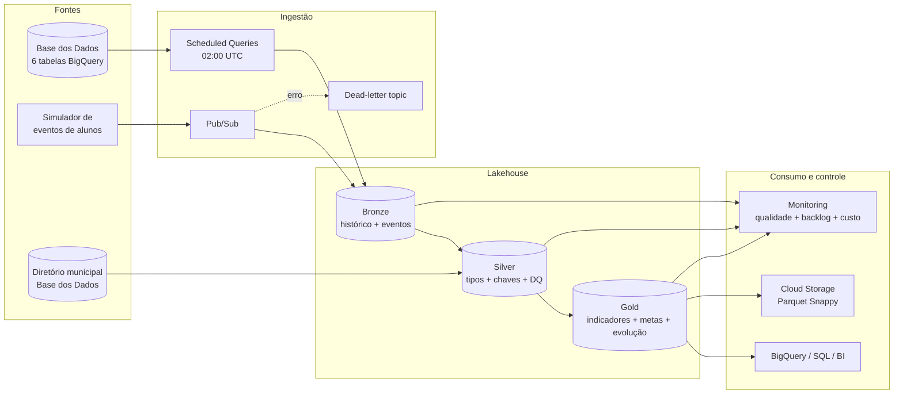

# Tech Challenge — Pipeline Híbrido da Alfabetização no Brasil

Solução de engenharia de dados para acompanhar resultados, metas e evolução da
alfabetização no Brasil. O projeto integra as seis entidades oficiais do INEP
publicadas pela Base dos Dados, combina processamento batch e streaming
simulado, aplica a arquitetura Medallion e entrega produtos Gold por município,
UF e horizonte de metas até 2030.

O corte adotado para classificar um aluno como alfabetizado é **743 pontos**, o
mesmo descrito no conjunto oficial. A cobertura disponível na fonte no momento
da construção é **2023–2024**.

## Status da entrega

| Item | Entrega | Estado |
|---|---|---|
| Pipeline batch | Seis tabelas, Bronze append-only | Executado localmente |
| Streaming | JSONL com checkpoint e Pub/Sub → BigQuery | Local validado; cloud provisionável |
| Bronze / Silver / Gold | Parquet ZSTD local; BigQuery particionado na nuvem | Validado |
| Qualidade | 35 verificações no ensaio local | **PASS — 100%** |
| Observabilidade | Manifestos, métricas, alerta de backlog, DLQ e runbook | Entregue |
| FinOps | Partição, cluster, Parquet, lifecycle e budget | Entregue |
| Infraestrutura | Terraform para Google Cloud | Sintaxe validada; não aplicada sem credenciais |
| Testes | 6 testes unitários/integração | **PASS** |
| Material executivo | Slides, roteiro e vídeo de até 5 minutos | Entregues separadamente, fora do Git |

Evidências reproduzíveis: [execução mais recente](artifacts/evidence/latest_run.json),
[qualidade](artifacts/evidence/latest_quality.json) e
[prévia Gold](artifacts/evidence/gold_indicador_municipio.csv).

> **Transparência dos dados:** os CSVs em `data/sample` são uma amostra sintética
> para execução sem credenciais. Códigos de municípios são reais; métricas,
> escolas e alunos são fictícios. O modo BigQuery e os scripts cloud consultam as
> tabelas oficiais completas.

## Execução rápida

Pré-requisito: Python 3.11 ou superior.

### Windows

```powershell
Set-ExecutionPolicy -Scope Process Bypass
.\scripts\run_local.ps1
```

### Linux/macOS

```bash
python -m venv .venv
source .venv/bin/activate
pip install -e .
python scripts/generate_sample_data.py
python -m alfabetizacao_pipeline.cli run-all --events 24
```

A execução cria os Parquets em `data/lake`, os relatórios em
`artifacts/evidence` e falha com código diferente de zero se uma regra crítica
de qualidade for violada.

## Arquitetura



No ambiente local, DuckDB substitui os serviços gerenciados e grava Parquet
ZSTD. Na nuvem, BigQuery executa os jobs batch e analíticos, enquanto uma
assinatura Pub/Sub escreve os eventos diretamente na Bronze. A lógica e o grão
das tabelas são equivalentes nos dois ambientes.

Mais detalhes: [arquitetura e decisões](docs/architecture.md).

## Fluxo Medallion

| Camada | Responsabilidade | Controles principais |
|---|---|---|
| Bronze | Preservar snapshots e eventos próximos da origem | `_ingested_at`, `_run_id`, `_source`, histórico por execução/data |
| Silver | Tipar, padronizar, deduplicar e integrar | chaves naturais, faixa 0–100, integridade municipal, corte 743 |
| Gold | Entregar indicadores de negócio | meta versus resultado, status, evolução anual, visão de streaming |

Produtos Gold:

- `indicador_municipio`: resultado, meta do ano, gap e status;
- `meta_resultado_municipio`: horizonte 2024–2030, incluindo anos sem resultado;
- `evolucao_municipio`: taxa anterior e variação anual em pontos percentuais;
- `resumo_uf`: síntese estadual, participação e meta;
- `monitoramento_stream`: volume, presença, proficiência e taxa da amostra recebida.

O [dicionário de dados](docs/data_dictionary.md) registra grão, chaves e campos.

## Qualidade de dados

As regras são executadas depois da Gold e produzem um JSON auditável. Falhas
críticas interrompem a execução; avisos preservam o resultado, mas reduzem o
score.

- presença e unicidade das chaves naturais nas seis entidades;
- taxas, metas e participação entre 0 e 100;
- soma dos nove níveis de desempenho igual a 100 (tolerância de 0,5 pp);
- integridade referencial dos municípios;
- consistência entre resultado municipal e tabela de metas;
- coerência entre `alfabetizado` e proficiência maior ou igual a 743;
- unicidade do grão Gold e completude do enriquecimento.

Na nuvem, `quality_checks.sql` termina com `ASSERT`: uma falha crítica marca o
agendamento como erro e alimenta o monitoramento.

## Batch e streaming

Batch local:

```bash
alfabetizacao-pipeline batch --run-id snapshot-001
alfabetizacao-pipeline silver
alfabetizacao-pipeline gold
alfabetizacao-pipeline quality --run-id snapshot-001
```

Streaming local com checkpoint de bytes:

```bash
alfabetizacao-pipeline simulate-stream --events 24
alfabetizacao-pipeline consume-stream --run-id stream-001
```

Streaming cloud depois do Terraform:

```bash
pip install -e ".[cloud]"
alfabetizacao-pipeline simulate-stream --target pubsub \
  --gcp-project SEU_PROJETO --topic alfabetizacao-alunos-events --events 24
```

O `event_id` é validado dentro do microbatch e a Silver deduplica por
`ano + id_aluno`, escolhendo a versão mais recente. Mensagens que não respeitam
o schema permanecem no backlog e, após cinco tentativas, seguem para a DLQ.

## Uso dos dados oficiais

Para extrair as seis tabelas localmente é necessário um projeto GCP com
faturamento habilitado:

```bash
pip install -e ".[cloud]"
gcloud auth application-default login
alfabetizacao-pipeline extract-bigquery \
  --billing-project SEU_PROJETO \
  --destination data/staging/oficial
alfabetizacao-pipeline run-all \
  --source-dir data/staging/oficial --events 24
```

Para um ensaio menor, `--student-limit 100000` limita somente `alunos`. Um
`LIMIT` não é usado como controle de custo na arquitetura cloud; os jobs
processam o contrato necessário e materializam camadas menores.

## Implantação GCP

Os recursos estão em [cloud/gcp](cloud/gcp/README.md). O fluxo básico é:

```bash
cd cloud/gcp
cp terraform.tfvars.example terraform.tfvars
terraform init
terraform validate
terraform plan
terraform apply
```

O ambiente foi implantado e validado no projeto GCP
`tech-challenge-fase-2-506814` em 27/08/2026. Foram criados os datasets Bronze,
Silver, Gold e Monitoring, bucket GCS, tópicos/assinatura Pub/Sub com DLQ,
tabela de streaming, IAM, métricas de logs e as consultas agendadas Bronze →
Silver → Gold, qualidade e exportação Parquet. O primeiro ciclo controlado
concluiu as 19 consultas; a qualidade registrou 7 verificações aprovadas e 0
falhas. Veja a [evidência da implantação](docs/cloud_deployment_status.md).

## FinOps

O cenário de referência (450 GiB consultados/mês, 25 GiB ativos no BigQuery,
1 GiB de eventos e 10 GiB em GCS) estima **menos de US$ 1/mês**, considerando as
franquias vigentes e antes de impostos/câmbio. Um budget de **R$ 10** foi criado
para o projeto, com limiares de 50%, 80% e 100%.

Controles implementados:

- BigQuery particionado por ano/data e clusterizado por município, UF e rede;
- materialização Bronze → Silver → Gold para evitar releitura desnecessária;
- Parquet ZSTD local e Parquet/Snappy no Cloud Storage;
- lifecycle para Nearline após 30 dias e limpeza de versões antigas;
- agendamentos diários em vez de infraestrutura ociosa;
- labels, relatório de bytes e orçamento com alertas progressivos.

Hipóteses, fórmulas e preços consultados: [FinOps](docs/finops.md).

## Observabilidade e operação

Cada execução local informa duração, linhas e bytes por camada. Na nuvem são
monitorados backlog do Pub/Sub, DLQ, falhas de scheduled queries, resultado das
regras de qualidade e orçamento. O [runbook](docs/monitoring_runbook.md) define
SLOs, diagnóstico, replay e resposta a incidentes.

## Testes e Git

```bash
python -m unittest discover -s tests -v
```

Os testes cobrem contrato da amostra, execução ponta a ponta, score de qualidade,
checkpoint do streaming, referências Terraform/SQL e ausência de credenciais.
A CI repete os testes e um smoke test em cada push/PR.

O repositório contém commits separados e merges de branches de feature. O
template de pull request exige evidências, avaliação de risco e rollback. Nenhum
PR remoto foi inventado: para criá-lo, publique este repositório em GitHub/GitLab.

## Estrutura

```text
alfabetizacao-data-pipeline/
├── src/alfabetizacao_pipeline/  # ingestão, streaming, Silver, Gold e DQ
├── data/sample/                  # amostra sintética no contrato oficial
├── cloud/gcp/                    # Terraform, schemas e 19 scripts BigQuery
├── tests/                        # unitários e integração ponta a ponta
├── docs/                         # arquitetura, dados, FinOps, segurança e runbook
├── artifacts/evidence/           # manifestos e prévia Gold
├── artifacts/executive/          # apresentação, roteiro e vídeo
└── .github/                      # CI e template de PR
```

## Decisões e trade-offs

- **GCP em vez de AWS/Azure:** a fonte já reside no BigQuery, eliminando egress e
  conectores adicionais.
- **Scheduled Queries em vez de cluster Spark permanente:** volume e frequência
  anual/diária não justificam infraestrutura ociosa; SQL serverless reduz custo
  e operação.
- **Pub/Sub → BigQuery direto:** menos componentes e baixa latência; Dataflow
  seria preferível para janelas complexas, enriquecimento evento a evento ou
  throughput muito maior.
- **DuckDB local:** reproduz SQL analítico e Parquet sem conta cloud; não pretende
  simular elasticidade distribuída.
- **At-least-once com deduplicação:** o desenho tolera reentrega por `event_id` e
  chave do aluno; exactly-once global exigiria maior custo/complexidade.

Registro formal: [ADR-001](docs/decisions/ADR-001-platform.md).

## Segurança, LGPD e IA

Os dados oficiais identificam escolas/alunos por códigos fictícios ou
pseudonimizados. O projeto não tenta reidentificar pessoas, não inclui
credenciais e aplica IAM por service account. Veja [segurança e LGPD](docs/security_lgpd.md).

IA generativa apoiou leitura do enunciado, desenho, implementação, testes e
documentação. Todas as decisões foram verificadas por execução local, contratos
oficiais e documentação primária. Veja a [declaração de uso de IA](docs/ai_usage.md).

## Fontes

- [Avaliação da Alfabetização — Base dos Dados](https://basedosdados.org/dataset/073a39d4-89cf-4068-b1e8-34ed0d9c0b72)
- [API Python da Base dos Dados](https://basedosdados.org/docs/api_reference_python)
- [Acesso via BigQuery e pacotes](https://basedosdados.org/docs/access_data_packages)
- [Preços do BigQuery](https://cloud.google.com/bigquery/pricing)
- [Preços do Pub/Sub](https://cloud.google.com/pubsub/pricing)
- [Preços do Cloud Storage](https://cloud.google.com/storage/pricing)

## Matriz de atendimento

A correspondência entre cada requisito do enunciado e sua evidência está em
[docs/evaluation_matrix.md](docs/evaluation_matrix.md).
