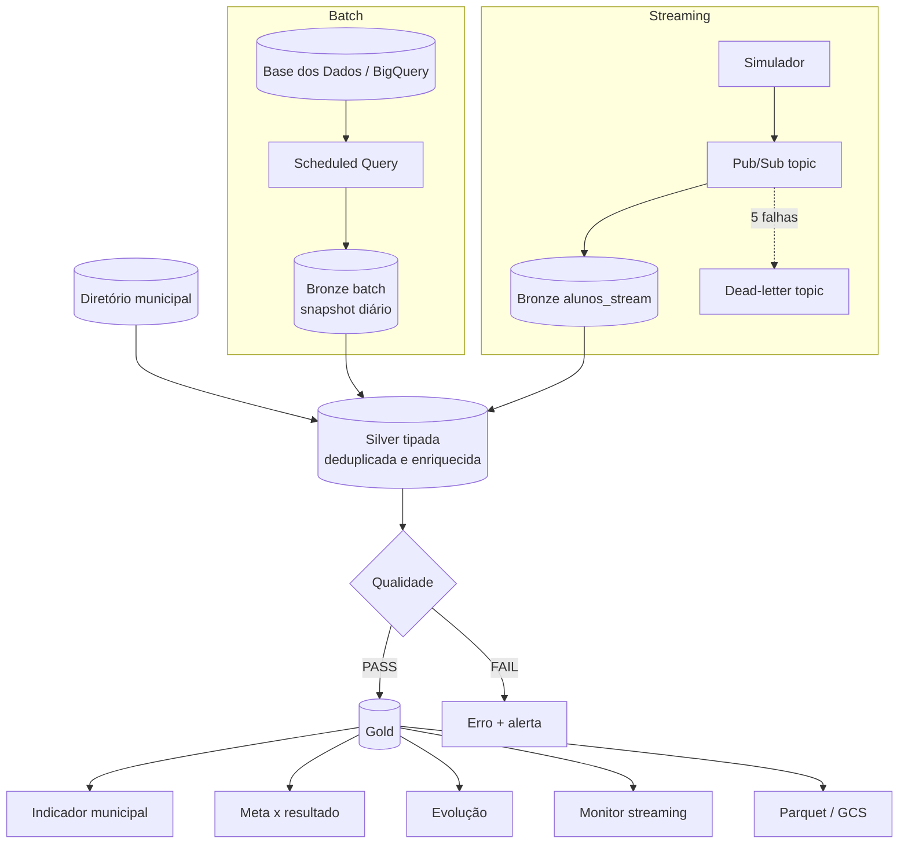
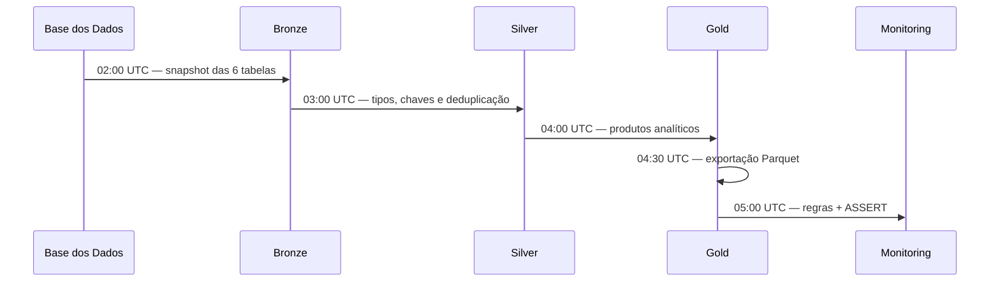

# Arquitetura da solução

## Visão lógica

## Fluxo físico

| Capacidade | Local | Google Cloud |
|---|---|---|
| Fonte batch | CSV sintético ou exportação real | `basedosdados.*` |
| Motor | DuckDB | BigQuery Scheduled Queries |
| Streaming | JSONL append-only | Pub/Sub |
| Bronze | Parquet ZSTD por run/ano | BigQuery por data de ingestão |
| Silver/Gold | Parquet ZSTD por ano | BigQuery por ano + clustering |
| Arquivo analítico | CSV de evidência | GCS Parquet/Snappy versionado |
| Orquestração | CLI/PowerShell | BigQuery Data Transfer Service |
| Observabilidade | JSON de execução/qualidade | Monitoring, Logging, DQ e budget |

## Sequenciamento cloud

As janelas de uma hora são conservadoras. Em produção, Cloud Composer ou
Workflows poderia substituir horários fixos por dependências explícitas se a
duração do batch crescesse.

## Idempotência e reprocessamento

- Bronze batch apaga apenas o snapshot da data atual antes de inseri-lo.
- Bronze local escreve em `run_id=<id>` e nunca substitui runs anteriores.
- Streaming local registra offset em bytes somente após o Parquet ser salvo.
- Streaming cloud pode reenviar; Silver escolhe a versão mais recente por
  `ano + id_aluno`.
- Silver e Gold são reconstruídas (`CREATE OR REPLACE`) a partir da Bronze.
- Mensagens incompatíveis seguem para DLQ após cinco tentativas.

## Grãos

| Tabela | Grão |
|---|---|
| Silver `uf` | ano + UF + série + rede |
| Silver `meta_alfabetizacao_uf` | ano + UF + rede |
| Silver `municipio` | ano + município + série + rede |
| Silver `meta_alfabetizacao_municipio` | ano + município + rede |
| Silver `alunos` | ano + aluno |
| Gold `indicador_municipio` | ano + município + série + rede |
| Gold `meta_resultado_municipio` | ano-meta + município + rede |

## Evolução futura

1. Substituir horários fixos por Workflows/Composer quando houver SLA rígido.
2. Usar Dataflow para agregação por janelas se o volume contínuo superar a
   assinatura direta no BigQuery.
3. Adicionar Looker Studio/Looker sobre as tabelas Gold.
4. Adotar Dataplex/Data Catalog para lineage e políticas em escala corporativa.
5. Versionar contratos com compatibilidade retroativa e testes de schema.

